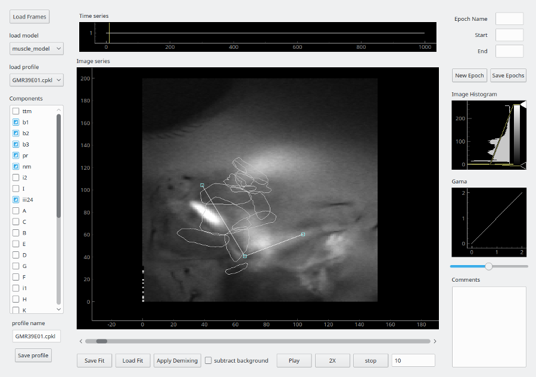

## muscle_unmixer 

Thad's GUI for muscle unmixing.



### Requirements

System packages (install via sudo apt-get)
* python-opencv 
* python-pyqt5 
* python-matplotlib

PYPI packages (automatically installed during pip install)
* numpy
* scipy
* h5py
* pyqtgraph

### Installation

```bash
pip install .
```

